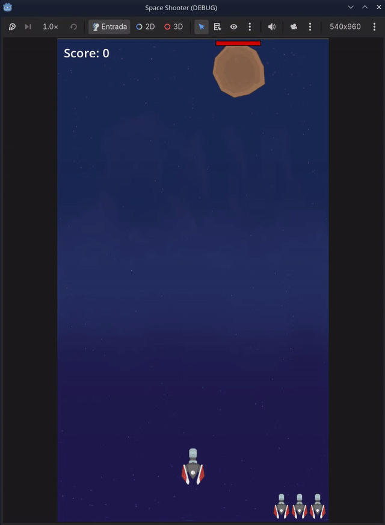

# 2D Space Shooter (Godot 4)



Protótipo jogável de um clássico shooter espacial 2D desenvolvido com **Godot 4.x** e **GDScript**, com foco em boas práticas de engenharia de software, desempenho e arquitetura orientada a eventos.

## 🕹️ Funcionalidades
* **Controles & Movimentação:** Nave com movimentação 2D, colisão com limites de tela e cadência de disparo controlada assincronamente (`await`).
* **Inimigos & Dinâmica de Dificuldade:** Spawn progressivo de meteoros com escalonamento de tempo (`wait_time`) travado com cláusula de proteção (`clamp`/`floor`).
* **Barras de Vida Flutuantes:** Nós `ProgressBar` customizados por meteoro com sincronização no ciclo de vida (`_ready()`) e atualização reativa.
* **HUD Reativo:** Exibição de vidas via `HBoxContainer` e pontuação atualizada via *Property Setters* para zero overhead no loop principal.

## 🛠️ Arquitetura & Decisões Técnicas
* **Observer Pattern (Sinais):** Entidades (projéteis, meteoros e gerenciador de jogo) desacopladas por meio de sinais dinâmicos conectados em tempo de execução via código (`signal.connect()`).
* **Event-Driven UI (Zero Polling):** Eliminação de leituras em `_process` para elementos de UI; a interface é atualizada estritamente sob demanda via interceptores de escrita (`set`), economizando ciclos de CPU.
* **Gerenciamento Seguro de Memória & Física:** Desativação imediata de colisores de projéteis (`set_deferred("disabled", true)`) para evitar processamento redundante de frames de colisão, com liberação determinística via `queue_free()`.
* **Tipagem Estática:** Uso de anotações de tipo estático (`Array[Node]`, `: int`, `: void`) para robustez e verificação em tempo de compilação.

## 🚀 Como Executar
1. Instale o **Godot Engine 4.x**.
2. Clone este repositório:
   ```bash
   git clone [https://github.com/SEU_USUARIO/NOME_DO_REPOSITORIO.git](https://github.com/SEU_USUARIO/NOME_DO_REPOSITORIO.git)
   ```
3. Abra a Godot, selecione **Import**, aponte para a pasta clonada e execute o projeto com `F5`.
